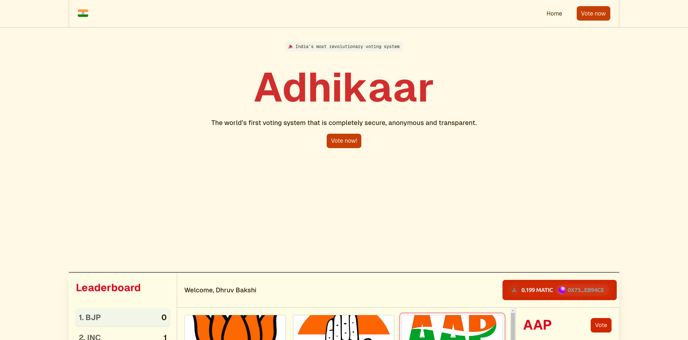
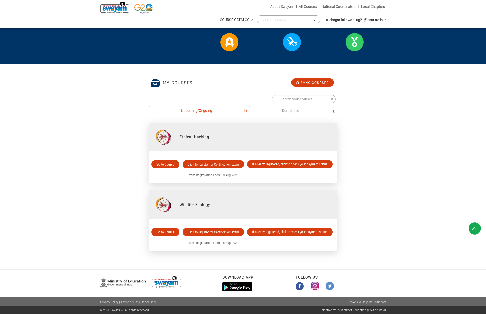

**Adhikaar: Decentralized Voting System on Polygon Blockchain**

Adhikaar, a revolutionary project aimed at transforming the Indian voting system
by leveraging the power of blockchain technology. Adhikaar, meaning 'right' in
Hindi, is designed to empower citizens by providing a transparent, secure, and
tamper-proof voting platform, thus reducing corruption in the Indian electoral
process. This decentralized voting system operates on the Polygon blockchain
network, ensuring fast and cost-effective transactions.

## Live Demo

[adhikaar.vercel.app](https://adhikaar.vercel.app/)

## Project Overview

Adhikaar is built on a robust tech stack, combining the best tools and
frameworks to create a seamless user experience. Here's an overview of our
technology choices:

- **Wagmi.js:** A powerful JavaScript library for interacting with the Polygon
  blockchain, ensuring smooth communication between the platform and the
  blockchain network.

- **WalletConnect:** A secure protocol for connecting decentralized applications
  to mobile wallets, enhancing user accessibility and convenience.

- **Next.js 13:** A popular React framework that simplifies the development of
  fast, responsive, and SEO-friendly web applications.

- **Tailwind CSS:** A highly customizable CSS framework that streamlines the
  styling process, providing a sleek and modern user interface.

- **Hardhat:** A development environment for Ethereum-compatible blockchains,
  facilitating smart contract development, testing, and deployment.

- **Replit:** An online coding platform that offers collaborative coding and
  instant deployment, enabling efficient teamwork and rapid prototyping.

- **Prisma:** A modern database toolkit for TypeScript and Node.js, simplifying
  database interactions and enhancing data security.

- **MongoDB:** A NoSQL database, chosen for its flexibility and scalability,
  ensuring efficient storage and retrieval of voting-related data.

## Features

Adhikaar boasts a wide range of features aimed at enhancing the voting
experience and ensuring the integrity of the electoral process:

- **Secure Voting:** Citizens can cast their votes securely, knowing that their
  choices are recorded on the immutable Polygon blockchain, preventing tampering
  or manipulation.

- **Transparency:** The entire voting process, from candidate registration to
  vote counting, is transparent and verifiable, promoting trust among voters.

- **Accessibility:** With WalletConnect integration, users can vote from the
  convenience of their mobile devices, increasing voter turnout and
  participation.

- **Real-time Results:** Results are calculated and displayed in real-time,
  providing instant feedback to candidates and voters alike.

- **Immutable Records:** All voting records are stored on the Polygon blockchain
  and can be audited by anyone, ensuring the integrity of the electoral data.

## Getting Started

To set up Adhikaar locally and contribute to its development, follow these
steps:

1. Clone the repository:
   `git clone https://github.com/Perpetual-Motion-Squad/Adhikaar.git`
2. Navigate to the project directory: `cd adhikaar`
3. Install dependencies: `npm install`
4. Start the development server: `npm run dev`

## Contact Us

If you have any questions, feedback, or suggestions, feel free to reach out to
us through Github issues and discussions.

Join us on this journey to redefine democracy and empower every citizen with
their Adhikaar - their right to vote.

Thank you for your interest and support!

**Team Perpetual-Motion-Squad**
